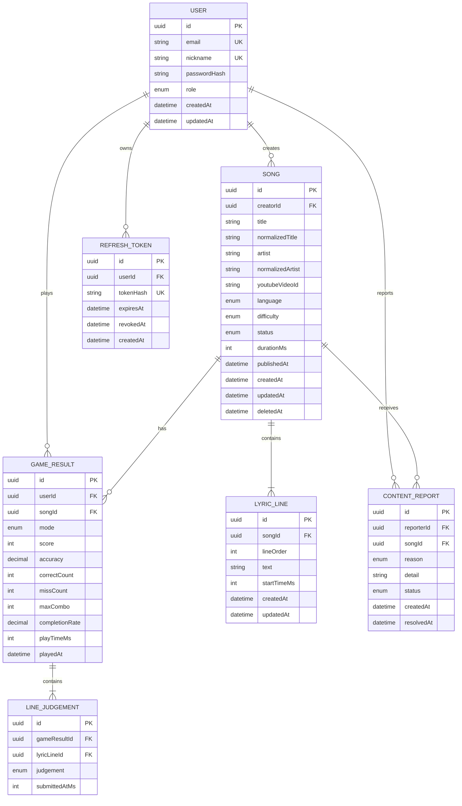

# JumpBeat 데이터베이스 구조

## 1. 관계도

## 2. 테이블 정의

### `users`

| 필드 | 타입 | 제약 | 설명 |
|---|---|---|---|
| `id` | UUID | PK | 사용자 ID |
| `email` | VARCHAR(320) | UNIQUE, NOT NULL | 소문자로 정규화한 이메일 |
| `nickname` | VARCHAR(30) | UNIQUE, NOT NULL | 표시 이름 |
| `password_hash` | VARCHAR(255) | NOT NULL | 단방향 해시 |
| `role` | ENUM | NOT NULL | `USER`, `ADMIN` |
| `created_at` | TIMESTAMPTZ | NOT NULL | 생성 시각 |
| `updated_at` | TIMESTAMPTZ | NOT NULL | 수정 시각 |

### `refresh_tokens`

| 필드 | 타입 | 제약 | 설명 |
|---|---|---|---|
| `id` | UUID | PK | refresh token ID |
| `user_id` | UUID | FK, NOT NULL | 소유 사용자 |
| `token_hash` | VARCHAR(64) | UNIQUE, NOT NULL | 원문 대신 저장하는 SHA-256 해시 |
| `expires_at` | TIMESTAMPTZ | NOT NULL | 만료 시각 |
| `revoked_at` | TIMESTAMPTZ | NULL | 사용·로그아웃으로 폐기된 시각 |
| `created_at` | TIMESTAMPTZ | NOT NULL | 생성 시각 |

refresh token은 갱신할 때마다 회전하며 기존 token은 즉시 폐기한다.

### `songs`

| 필드 | 타입 | 제약 | 설명 |
|---|---|---|---|
| `id` | UUID | PK | 곡 ID |
| `creator_id` | UUID | FK, NOT NULL | 등록자 |
| `title` | VARCHAR(150) | NOT NULL | 표시할 제목 |
| `normalized_title` | VARCHAR(150) | INDEX, NOT NULL | 중복 검색용 정규화 제목 |
| `artist` | VARCHAR(100) | NOT NULL | 가수명 |
| `normalized_artist` | VARCHAR(100) | INDEX, NOT NULL | 중복 검색용 정규화 가수명 |
| `youtube_video_id` | VARCHAR(20) | INDEX, NOT NULL | YouTube videoId |
| `language` | ENUM | NOT NULL | `KO`, `EN`, `JA`, `OTHER` |
| `difficulty` | ENUM | NOT NULL | `EASY`, `NORMAL`, `HARD` |
| `status` | ENUM | INDEX, NOT NULL | `DRAFT`, `PUBLISHED`, `HIDDEN`, `UNAVAILABLE` |
| `duration_ms` | INTEGER | NULL | 확인된 영상 길이 |
| `published_at` | TIMESTAMPTZ | NULL | 공개 시각 |
| `created_at` | TIMESTAMPTZ | NOT NULL | 생성 시각 |
| `updated_at` | TIMESTAMPTZ | NOT NULL | 수정 시각 |
| `deleted_at` | TIMESTAMPTZ | NULL | 소프트 삭제 시각 |

`normalized_title + normalized_artist`에는 UNIQUE 제약을 두지 않는다. 중복 곡 등록을 허용하기 때문이다.

### `lyric_lines`

| 필드 | 타입 | 제약 | 설명 |
|---|---|---|---|
| `id` | UUID | PK | 가사 줄 ID |
| `song_id` | UUID | FK, NOT NULL | 소속 곡 |
| `line_order` | INTEGER | NOT NULL | 0부터 시작하는 표시 순서 |
| `text` | VARCHAR(500) | NOT NULL | 가사 한 줄 |
| `start_time_ms` | INTEGER | NULL | 초안에서는 NULL 가능, 공개 시 필수 |
| `created_at` | TIMESTAMPTZ | NOT NULL | 생성 시각 |
| `updated_at` | TIMESTAMPTZ | NOT NULL | 수정 시각 |

제약 조건:

- `(song_id, line_order)` UNIQUE
- `start_time_ms >= 0`
- 공개 처리 시 모든 시작 시간이 존재하고 순서대로 증가하는지 애플리케이션에서 검증

### `game_results`

| 필드 | 타입 | 제약 | 설명 |
|---|---|---|---|
| `id` | UUID | PK | 결과 ID |
| `user_id` | UUID | FK, NOT NULL | 플레이 사용자 |
| `song_id` | UUID | FK, NOT NULL | 플레이 곡 |
| `mode` | ENUM | NOT NULL | `CONTINUE`, `SURVIVAL` |
| `score` | INTEGER | NOT NULL | 서버가 재계산한 점수 |
| `accuracy` | DECIMAL(5,2) | NOT NULL | 0~100 |
| `correct_count` | INTEGER | NOT NULL | 정답 수 |
| `miss_count` | INTEGER | NOT NULL | Miss 수 |
| `max_combo` | INTEGER | NOT NULL | 최대 콤보 |
| `completion_rate` | DECIMAL(5,2) | NOT NULL | 0~100 |
| `play_time_ms` | INTEGER | NOT NULL | 실제 플레이 시간 |
| `played_at` | TIMESTAMPTZ | NOT NULL | 플레이 완료 시각 |

### `line_judgements`

클라이언트가 전송한 판정 기록을 저장하거나 검증하는 테이블이다. MVP에서는 결과 저장 후 일정 기간만 유지하거나 JSON 컬럼으로 대체할 수도 있다.

| 필드 | 타입 | 제약 | 설명 |
|---|---|---|---|
| `id` | UUID | PK | 판정 ID |
| `game_result_id` | UUID | FK, NOT NULL | 결과 ID |
| `lyric_line_id` | UUID | FK, NOT NULL | 가사 줄 ID |
| `judgement` | ENUM | NOT NULL | `CORRECT`, `WRONG`, `TIMEOUT` |
| `submitted_at_ms` | INTEGER | NULL | 영상 기준 제출 시간, 시간 초과는 NULL 가능 |

### `content_reports`

| 필드 | 타입 | 제약 | 설명 |
|---|---|---|---|
| `id` | UUID | PK | 신고 ID |
| `reporter_id` | UUID | FK, NOT NULL | 신고자 |
| `song_id` | UUID | FK, NOT NULL | 신고 대상 |
| `reason` | ENUM | NOT NULL | `COPYRIGHT`, `INAPPROPRIATE`, `BROKEN_VIDEO`, `OTHER` |
| `detail` | VARCHAR(1000) | NULL | 상세 내용 |
| `status` | ENUM | NOT NULL | `OPEN`, `RESOLVED`, `REJECTED` |
| `created_at` | TIMESTAMPTZ | NOT NULL | 신고 시각 |
| `resolved_at` | TIMESTAMPTZ | NULL | 처리 시각 |

## 3. 주요 인덱스

- `users(email)` UNIQUE
- `users(nickname)` UNIQUE
- `songs(status, published_at DESC)`
- `songs(normalized_title, normalized_artist)`
- `songs(youtube_video_id)`
- `lyric_lines(song_id, line_order)` UNIQUE
- `game_results(user_id, played_at DESC)`

## 4. 삭제 정책

- 곡은 `deleted_at`을 사용하는 소프트 삭제를 기본으로 한다.
- 삭제된 곡은 목록과 신규 플레이에서 제외한다.
- 과거 게임 결과는 통계 및 사용자 기록을 위해 유지한다.
- 회원 탈퇴 정책은 구현 전에 별도로 확정한다.
